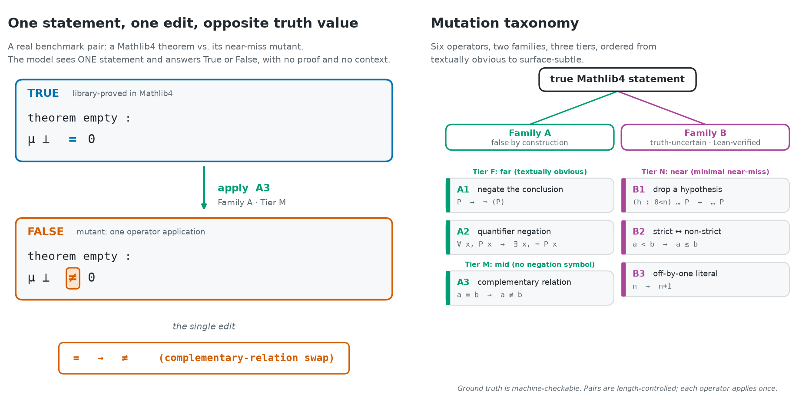

# TrueOrPlausible

**Can a small language model tell a real theorem from a near-miss that's quietly false, and does it *know* when it's unsure?**

We take true theorems from [Mathlib4](https://github.com/leanprover-community/mathlib4)
(the large formal-mathematics library for the Lean theorem prover) and apply one tiny,
truth-flipping edit to each: swap a `=` for a `≠`, drop a hypothesis, change an `n` to an
`n+1`. The result *looks* like a theorem but isn't. A small open model gets one statement
and must answer **True** or **False**, with no proof and no context. We measure both whether
it gets the answer right and whether its confidence is *calibrated*.

## The question

Language models are increasingly trusted to check mathematical and logical claims. But a
false statement that is one character away from a true one is exactly where a model that
pattern-matches on "looks like math" rather than reasoning should fail, and fail
*confidently*. Because every label here is **machine-checkable** (Mathlib4 statements carry
formal proofs; the false ones are false by construction or Lean-verified), we can ask the
question cleanly that natural-language fact-checking benchmarks can't: not "does it sound
right?" but "is it actually a theorem?" And does the model's confidence collapse exactly
where the lie is hardest to see?



*A real benchmark pair (left): one `=`→`≠` edit turns a proved theorem into a non-theorem
without changing its length or adding a negation symbol. The mutation taxonomy (right) ranges
from textually obvious (Tier F) to surface-subtle (Tier N).*

## How it works

Each benchmark item is a pair. I sample a true theorem from a pinned Mathlib4-derived pool and
generate one matched false mutant for it using one of six operators from the taxonomy above, so
the pair is the same statement before and after a single edit, length-controlled so the model
can't win by counting characters. The falsehoods come in two families. Family A mutants are
false by construction (negate the conclusion, swap a relation for its complement) and need no
proof checker. Family B mutants are the genuinely hard near-misses that *might* still be true
(drop a hypothesis, an off-by-one), so those have to be Lean-verified false before they're
allowed into the set.

At query time each statement is shown alone under a frozen prompt and the model answers True or
False at temperature 0, with confidence read straight from the answer-token probabilities rather
than a self-reported number it could game. I score two things per perturbation tier: AUROC, for
whether it can tell true from false at all, and ECE, for whether its uncertainty is where it
should be, both with cluster bootstrap confidence intervals. And there's a shortcut guard. A
surface-feature-only baseline (statement length, symbol counts, nesting depth) sets the bar, and
a model only counts as "understanding" the statement if it beats what you could predict from the
text's shape alone.

## What makes it rigorous

Everything was pre-registered before a single model ran. The hypotheses, thresholds, the
mutation taxonomy, the pinned dataset revisions, the model roster, and the full analysis plan
went into [`PRE_REGISTRATION.md`](PRE_REGISTRATION.md) before any statement was sampled, any
mutant generated, or any model queried, and the only post-lock change is a labeled amendment
made before any outcome was seen. The ground truth is machine-checkable rather than
hand-annotated: the true statements are proved in Mathlib4, and the Family-B falsehoods are
confirmed false by Lean rather than assumed.

A null here is a real result. If every model sits at chance, then the finding that small open
models cannot judge formal-statement veracity, together with the released reusable benchmark, is
the contribution, and it gets reported in full rather than quietly shelved. The accounting is
honest by construction: every drop, cap, and exclusion in the build is logged and reported, and
the benchmark content is hash-locked in
[`results/benchmark_manifest.json`](results/benchmark_manifest.json). 68 tests cover taxonomy
fidelity, determinism, the prompt-freeze gate, and synthetic planted-signal and null recovery of
the scoring code.

## Status

**Pipeline built and tested; model runs not yet started (by design).** The pre-registration
is locked and the full pre-model pipeline (mutation engine, benchmark builder, run harness,
and scoring) is implemented and unit-tested. The benchmark (v1.0) is built and hash-locked.
**No language model has been queried yet:** the model backends are deliberately gated until
an explicitly recorded go decision, so the pre-registered tests run exactly once, in the
registered order, with no peeking. Lean verification of the Family-B (near-miss) mutants is
deferred; per the pre-registered fallback, v1 ships Family A only until that pass runs.

## Reproduce

No model, GPU, or paid API is needed for any step below; all of it is CPU-only and runs on
a laptop.

```bash
python -m venv .venv && .venv/bin/pip install -r requirements.txt
.venv/bin/python -m src.fetch_data --pool      # stream-extract the pinned statement pool (~94 MB on disk; the 7.8 GB raw file is never written)
.venv/bin/python -m src.build_benchmark        # rebuild the benchmark byte-for-byte
.venv/bin/python -m pytest tests/ -q           # 68 tests, no model required
.venv/bin/python -m src.figures.make_overview_figure   # regenerate the figure above
```

Reproducibility is hash-checked: rebuilding from the pinned pool yields the exact
`benchmark_sha256` and `content_hash_sha256` recorded in
[`results/benchmark_manifest.json`](results/benchmark_manifest.json) (seed `20260611`).
The fetch and build steps are idempotent (re-running skips completed work), and the figure
is a design schematic drawn from the built benchmark, not from any model output. The
embargoed model run (`src/harness.py`) is double-gated and intentionally not part of this
reproduce path.

## Links

- [`PRE_REGISTRATION.md`](PRE_REGISTRATION.md): the locked design (start here)
- [`data/README.md`](data/README.md): data sources, pinned revisions, fetch commands
- [`docs/related_work.md`](docs/related_work.md): closest prior work and how this differs
- [`src/`](src/): fetch / mutate / build / harness / score modules
- [`results/benchmark_manifest.json`](results/benchmark_manifest.json): hash-locked benchmark provenance

**Data & prior art.** Statements come from `l3lab/ntp-mathlib` (Mathlib4-derived), with
`l3lab/miniCTX` / `miniCTX-v2` as a held-out recency probe, all public Hugging Face datasets,
revisions pinned in the pre-registration. The closest related benchmarks are NumPert
(arXiv:2511.09971), BrokenMath (arXiv:2510.04721), and MATH-Perturb (arXiv:2502.06453), all on
natural-language math; this project's distinguishing move is **formal, machine-checkable**
ground truth with **calibration** measured per perturbation tier.
